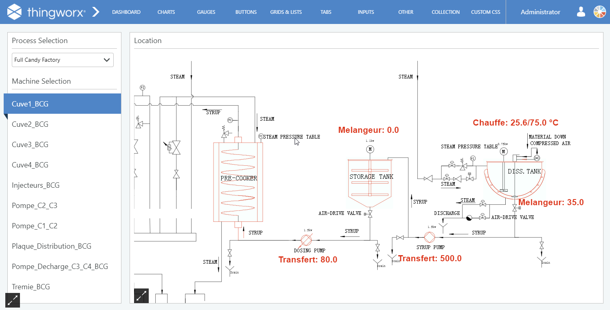
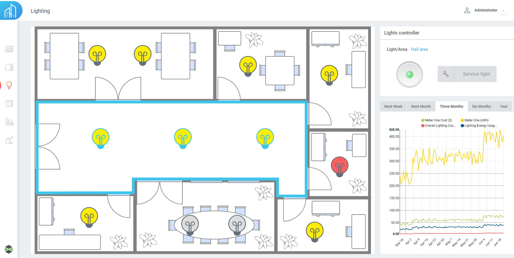
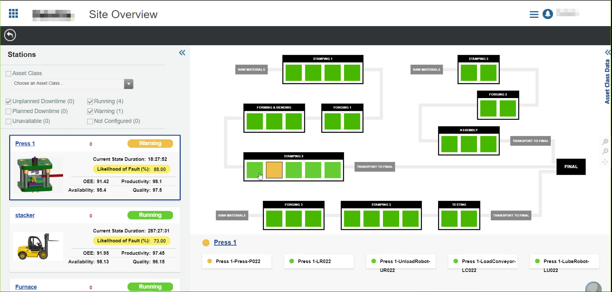
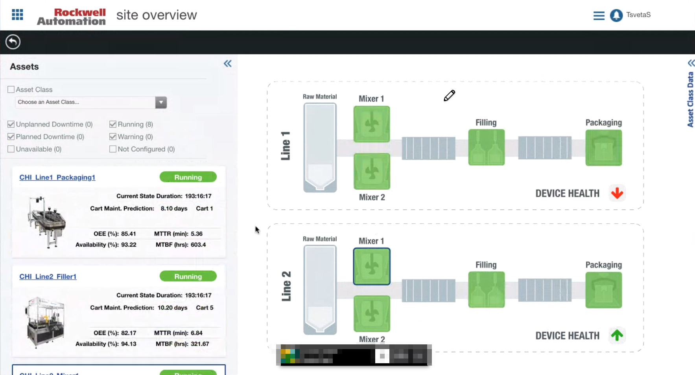

# SVG viewer for Thingworx

View dynamic responsive SVG files within Thingworx, in order to show plant layouts, floor maps, process diagrams and a wide variety of other usecases.

# Index

[TOC]


# About
This is a Thingworx widget allowing visualization of dynamic [SVG](https://en.wikipedia.org/wiki/Scalable_Vector_Graphics) files. It works by receiving an SVG file and an InfoTable dataset containing "overrides". Using this "overrides" you can modify the attributes of any SVG element to do stuff like changing colors, strings or even dimensions of an element.
Additionally, it has features like dynamic pan and zoom and synchronized selection for more specific usecases.

# Usage

Here is how to use the with a simple SVG file and a dataset:

### The SVG file

The widget accepts any standard SVG file, either generated manually, via a Vector based tool like Adobe Illustrator, Corel Draw or Inkscape, or transformed from another format. For example, you can convert PDF or DWG schematics to SVG using online tools, and use that SVG in the widget.

To illustrate the features of the SVG widget, assume the following SVG file, where the elements that you want to update/interact with are clearly identifiable (via `id` or a custom attribute, like the `tagName` below)
Here is the [SVG](example/sample.svg) file in this example:

```svg
<svg width="580" height="400" 
    xmlns="http://www.w3.org/2000/svg">
    <path fill="none" stroke="#000" stroke-width="1.5" d="m132.5,66.4375l-36.5,103.5625l62,-48l24,-45l-49.5,-10.5625z" identifier="myPath1"/>
    <text fill="#000000" stroke="#000" stroke-width="0" x="133.5" y="159.4375" identifier="myText1" font-size="24" font-family="Helvetica, Arial, sans-serif" text-anchor="start">Text1</text>
    <g identifier="myGroup2">
        <line fill="none" stroke="#000" stroke-width="1.5" x1="358.5" y1="86.4375" x2="340.5" y2="172.4375"/>
        <line fill="none" stroke="#000" stroke-width="1.5" x1="415.5" y1="180.4375" x2="336.5" y2="167.4375"/>
        <line fill="none" stroke="#000" stroke-width="1.5" x1="366.5" y1="84.4375" x2="414.5" y2="170.4375"/>
        <ellipse fill="none" stroke="#000" stroke-width="1.5" cx="396" cy="112.4375" rx="13.5" ry="16"/>
    </g>
    <rect fill="none" stroke-width="1.5" x="329.5" y="79.4375" width="94" height="110" stroke="#000" identifier="elementSelectable2"/>
    <text fill="#000000" stroke="#000" stroke-width="0" x="348.5" y="216.4375" identifier="myText2" font-size="24" font-family="Helvetica, Arial, sans-serif" text-anchor="start">Text2</text>
    <line fill="none" stroke="#000" stroke-width="1.5" x1="165.5" y1="107.4375" x2="330.5" y2="140.4375" identifier="myLine3" class="test"/>
    <path fill="none" stroke="#000" stroke-width="1.5" d="m218.5,125.4375l5.5,-22.4375l16,18l-21.5,4.4375z" identifier="myPath3" otherIdentifier="selector4"/>
</svg>
```

```

```

This file contains 3 main "elements". The path with "Text1" written underneath it, a complex shape labeled "Text2" and a line between them.

The SVG file can be stored either in a FileRepository, as a MediaEntity, or, eternal to Thingworx, by adding a complete URI.

### The data infotable
By default your SVG will be static, meaning that it will show up as designed. However you can change it's appearance by using an infotable that contains “overrides”.

There are two ways of declaring this overrides:

#### Overrides in a nested infotable

The best way to do it is to use a nested infotable for your overrides. By using a nested infotable, you can group together multiple elements in the SVG under the same row. A common usecase is when you want to have synchronized selection between _multiple_ elements in the SVG and one element in a list/grid.

So, for the SVG above, this infotable can be:

| ElementGroup1   | AdditionnalMetadata    | Overrides          |
| --------------- | ---------------------- | ------------------ |
| MyElementGroup1 | Description of element | `NestedInfotable1` |
| MyElementGroup2 | Description of element | `NestedInfotable2` |
| MyElementGroup3 | Description of element | `NestedInfotable3` |

Here, we have a simple infotable intended to be displayed both in a list and as the datasource for the SVG widget. When displayed on the list, only the 3 elements will appear. The SVG widget will use only the __Overrides__ column. 

- The `NestedInfotable1` for the first row can be:

| elementName | elementSelector | text      | stroke | fill                   | selectable |
| ----------- | --------------- | --------- | ------ | ---------------------- | ---------- |
| myPath1     |                 |           | red    | rbga(107,249,236,0.05) | TRUE       |
| myText1     |                 | New Text! |        |                        | FALSE      |

The first row means that the widget will search for an element that has the `identifier` attribute equal to `myPath1`, change the `stroke` attribute to `red`, the fill to `rbga(107,249,236,0.05)`.  You can add additional columns in your datashape, to override additional element attributes. Additionally, the element is marked as `selectable` meaning that it will be clickable and can drive synchronized selection.

The second row means that the contents of element with the `identifier` equal to `myText1` will be changed to `New Text!`. This text element is not selectable, and we are not overriding any of the other attributes.

- The `NestedInfotable2` for the second row can be:

| elementName        | elementSelector | text       | stroke | fill                   | selectable |
| ------------------ | --------------- | ---------- | ------ | ---------------------- | ---------- |
| myGroup2           |                 |            | green  |                        | FALSE      |
| myText2            |                 | New Text2! | red    |                        | FALSE      |
| elementSelectable2 |                 |            |        | rbga(107,249,236,0.05) | TRUE       |

#### Overrides in a flat infotable

If synchronized selection between an external list and the svg widget is not needed, you can also use a flat infotable for the overrides.  However, you lose the capability to disable selection on some elements.

| elementName        | AdditionalMetadata | override-fill          | override-stroke | override-text |
| ------------------ | ------------------ | ---------------------- | --------------- | ------------- |
| myPath1            |                    | rbga(107,249,236,0.05) | red             |               |
| myText1            |                    |                        |                 | New Text!     |
| myGroup2           |                    |                        | green           |               |
| myText2            |                    | red                    |                 | New Text2!    |
| elementSelectable2 |                    | rbga(107,249,236,0.05) |                 |               |

The only required column is `ElementName`. This column maps the override rows to the elements in the svg. For example, the infotable above will change the `fill`, `stroke` and `override-text` of all the elements in the group `myPath1` to the values (`rbga(107,249,236,0.05)`, `red` and `_` respectively).

The elements in the infotable also dictate what elements are clickable. 

#### Types of overrides 

It's also important to note that the overrides for  `fill`, `stroke` are just examples. You can override any attribute of the svg, including dimensions like `width` or `height`, position like `x` and `y`. However, there are a couple of special `overrides` that you can include:
   * `tooltip`: Specify a tooltip for an element. This is visible when hovering.
   * `text-stroke-width`: If you override the `stroke-width` of a group, you may find that the `text` elements are hard to read. This is a special override for the `stroke-width` that applies only to `text` elements.
   * `text`: Change the contents of a `<text>` or `<tspan>` element. If a string is empty or undefined, it will not be updated. For specifying an empty value, use ` ` (a space).
   * `class`: Class to add to the element. The exiting classes are not removed, but rather the new class is appended.
   * `selectable`: Marks the element as clickable, meaning that it can drive the synchronized selection. 

### Bindings and properties

* `SVGFileUrl`: Do not select a MediaEntity using the entity picker. A binding must be created.  The SVG file can be stored either in a FileRepository, as a MediaEntity, or, eternal to Thingworx, by adding a complete URI.
* `Data`: An infotable containing the overrides for elements in the SVG. See the section above for information about the possible structures of this overrides tables. Keep in mind that synchronized selection is supported on this property.
* `DataIdField`: The column in your overrides infotable with the element to match. If using a nested override table, this column refers to the column inside a nested row.
* `SVGIdField`: the name of the attribute in the svg that maps with the  `DataIdField`.
* `DataSelectorField`: The column in your overrides infotable containing a css selector to identify an element in the infotable. If this value is present on the override, then the element will be identified using the selector, and not using the combination of `DataIdField` and `SvgIdField`.
* `SelectedStyle`: style of the selected elements. The style definition is applied as following: 
  * `Background Color` -> `fill` attribute
  * `Line Color` -> `stroke` attribute
  * `Line Thickness` -> `stroke-width` attribute
  * The rest of the properties in the style definition are ignored.
* `ApplyToChildren`: This specifies whether to apply the overrides to the element or to its children recursively. Default is `true` but, in most cases, you want this `false`.
* `ZoomPanEnabled`: Enable zooming and and panning around the svg. Especially useful interaction is needed and the svg contains a schematic that is too big to represent. If it's enabled, than you can configure the initial zoom level or the position using the `InitialXPosition`, `InitialYPosition` and `IntialZoom` If not, you can scale the SVG as you want.
* `SelectedElementID`: property available at runtime that is equal to the attribute of the current selected element.

The following events are also available:
* `ElementClicked`, `ElementDoubleClicked`, `ElementMiddleClicked`. They are triggered after a named element has been clicked.

The following service is available:
* `PanOntoSelected`: Pans onto the selected element, as to bring it into the center of the screen. `ZoomPanEnabled` must be set to true for this to work.


### Installation
- Navigate to the [releases page](/releases)
- Under the latest release, view all the assets
- Download the file `svgViewer-min-<VERSION>.zip`
- Import the widget into Thingworx

# Development
This projects welcomes contributions. For details about pre-requisites, development environment and file structure, please see stefan-lacatus/ThingworxDemoWebpackWidget. 

## Build

The following commands allow you to build and compile your widget:

* `npm run build`: builds the extension. Creates a new extension zip file under the `zip` folder.
* `npm run watch`: watches the source files, and whenever they change, do a build
* `npm run upload`: creates a build, and uploads the extension zip to the thingworx server configured in `package.json`.

#  Resources
## SVG Demo starter kit

Inside this repository, under `/demo` you can also find a Thingworx starter project that can help you get started with the widget. The demo is based on the [WebDesignKit by Dumitru Zanfir](https://marketplace.ptc.com/apps/201557/web-design-kit#!overview)



The goal of the demo is to provide a starting point for creating a ThingModel that easily ties in with the SvgWidget. So, we have a Network of Things, each implementing the `SvgEnabledThingShape`. Then, each thing, via the `GetSvgOverrides` service returns the specific overrides of that thing.

The prebuilt mashup, `SvgVisualizationWebDesign`, uses the `SvgDataCollectorThing` that _collects_ data from all the things in a network with the `SvgEnabledThingShape` and generates a nested overrides Dataset.

### Installation

1. Install the [WebDesignKit by Dumitru Zanfir](https://marketplace.ptc.com/apps/201557/web-design-kit#!overview)
2. Install the [D3RangeChart Widget](https://github.com/ptc-iot-sharing/D3RangeChart)
3. Install the SVG widget
4. Import the [demo/SvgStarterEntities.xml](demo/SvgStarterEntities.xml)
5. Import the [demo/SvgCandyFactoryEntities.xml](demo/SvgCandyFactoryEntities.xml)
6. Upload the 3 svg files in demo to the `SvgFileRepository`
7. View the `SvgVisualizationWebDesign` mashup

### Usage

1. Upload your own SVG file into `SvgFileRepository`
2. On your things, add the `SvgEnabledThingShape`, and override the service `GetSvgOverrides` . Use the existing things as an example.
3. Modify the *SvgFilesToDisplay* property on `SvgDataCollectorThing`. 
4. Create a network with your things.

#  Gallery







# Credit/Acknowledgment
Petrisor Lacatus  (@stefan-lacatus)

#  License
[ISC License](LICENSE.MD)
